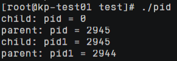

# 操作系统实验1

## 进程实验

### wait函数

将操作系统原理课程教材P103作业3.7（图3-32）中的代码进行编译后报错：


发现是wait()函数未声明，添加头文件<wait.h>后成功通过编译

程序运行结果如下（选取了几个典型输出）：





这与去除wait()函数后的运行结果相同，父、子进程的输出顺序是随机的，原因在于源程序中的wait()函数是在输出语句之后，故父进程在输出语句之后才会阻塞自己并等待子进程结束。

修改程序，将wai()函数添加到父进程的输出语句之前，程序重新编译运行的结果如下：


程序多次运行的结果都是子进程先输出，之后父进程才输出，这与预期相符

同时，观察发现：子进程的pid总是为0，且子进程的pid1与父进程的pid始终相等，父进程的pid始终比其pid1大1

总结分析：

1）fork函数：在父进程中，fork返回新创建子进程的进程ID；在子进程中，fork返回0；如果出现错误，fork返回一个负值；

2）getpid函数：返回当前进程ID；

3）wait函数：父进程一旦调用了wait就立即阻塞自己，由wait自动分析当前进程的某个子进程是否已经退出，如果找到了这样的子进程，wait就会收集这个子进程的信息，并把它彻底销毁后返回；如果没有找到这样一个子进程，wait就会一直阻塞在这里，直到有一个出现为止；

4）僵尸进程：一个进程使用fork创建子进程，如果子进程退出，而父进程并没有调用wait或waitpid获取子进程的状态信息，那么子进程的进程描述符仍然保存在系统中。这种进程称之为僵尸进程；

5）孤儿进程：一个父进程退出，而它的一个或多个子进程还在运行，那么那些子进程将成为孤儿进程。孤儿进程将被init进程(进程号为1)所收养，并由init进程对它们完成状态收集工作。

源代码：

```c
#include <sys/types.h>
#include <stdio.h>
#include <unistd.h>
#include <wait.h>

int main() {
	pid_t pid, pid1;

	// fork a child process
	pid = fork();

	// error occurred
	if (pid < 0) {
		fprintf(stderr, "Fork Failed\n");
		return 1;
	}
	// child process
	else if (pid == 0) {
		pid1 = getpid();
		printf("child: pid = %d\n", pid);
		printf("child: pid1 = %d\n", pid1);
	}
	// parent process
	else {
		//wait(NULL);
		pid1 = getpid();
		printf("parent: pid = %d\n", pid);
		printf("parent: pid1 = %d\n", pid1);
		wait(NULL);
	}

	return 0;
}
```

### 全局变量

定义全局变量值为0，在父进程中对其执行递增操作，在子进程中对其执行递减操作。在父、子进程中分别输出全局变量的值和地址，程序运行结果如下：


观察发现：子进程中count值为-1，父进程中count值为1，但两者地址相同

分析：内核会为每个进程分配一定的虚拟地址空间，这些虚拟地址空间地址分布都是一样的，由于子进程虚拟地址空间的数据都是从父进程中拷贝而来的，因此相同的数据在虚拟地址空间中的分布也是一样的，但是由于相同的虚拟地址映射到不同的物理地址，所以我们才会得到不同的全局变量值。

在return前对全局变量进行递增操作后，输出全局变量的值和地址，程序运行结果如下：


观察发现：子程序中count值为0，父进程中count值为2，且两者地址相同

分析：同样是由于父、子进程中全局变量的虚拟地址相同但物理地址不同，因此子进程中原本为-1的count递增为0，而父进程中原本为1的count递增为2。

源代码：

```c
#include <sys/types.h>
#include <stdio.h>
#include <unistd.h>
#include <wait.h>

int count = 0;

int main() {
	// fork a child process
	pid_t pid = fork();

	// error occurred
	if (pid < 0) {
		fprintf(stderr, "Fork Failed\n");
		return 1;
	}
	// child process
	else if (pid == 0) {
		count--;
		printf("child: count = %d\n", count);
		printf("child: count address = %p\n", &count);
	}
	// parent process
	else {
		wait(NULL);
		count++;
		printf("parent: count = %d\n", count);
		printf("parent: count address = %p\n", &count);
	}
    
    count++;
	printf("before return: count = %d\n", count);
	printf("before return: count address = %p\n", &count);

	return 0;
}
```

### system函数与exec族函数

在父、子进程中分别输出进程ID，并在子进程中调用system函数或exec族函数执行hello程序，hello程序中也输出进程ID

调用system函数的运行结果如下：


调用execl函数的运行结果如下：


观察发现：调用system后hello程序中的pid比子进程pid大1，而调用execl后hello程序中的pid与子进程相同

分析：

1）system函数会再创建一个子进程，并在该子进程中调用execl函数执行原参数中的命令；

2）当进程调用一种exec函数时，该进程的用户空间代码和数据完全被新程序替换，从新程序的启动例程开始执行（当前进程剩下的程序代码便不再执行）。调用exec并不创建新进程，所以调用exec前后该进程的ID并未改变。当函数调用失败时，返回值为-1，调用成功则无返回值。

源代码：

```c
#include <sys/types.h>
#include <stdio.h>
#include <unistd.h>
#include <wait.h>
#include <stdlib.h>

int main() {
    // fork a child process
    pid_t pid = fork();

    // error occurred
    if (pid < 0) {
		fprintf(stderr, "Fork Failed\n");
		return 1;
    }
    // child process
    else if (pid == 0) {
    	printf("child: pid = %d\n", getpid());
		//system("./hello");
		execl("./hello", "hello", NULL);
    }
    // parent process
    else {
    	wait(NULL);
		printf("parent: pid = %d\n", getpid());
    }

    return 0;
}
```

```c
//子进程中system或execl函数调用的代码，可执行文件名为hello
#include <stdio.h>
#include <sys/types.h>
#include <unistd.h>

int main(){
	printf("Hello World!\n");
	printf("hello: pid = %d\n", getpid());
	
	return 0;
}
```

## 线程实验

将全局变量初始化为0，创建两个线程，分别对全局变量进行5000次递增和递减操作

编译出错：


报错信息显示pthread库中的函数是未定义的引用

解决方法：gcc -o thread -lpthread thread.c

参考资料：https://blog.csdn.net/besfanfei/article/details/7542396

正确编译后，程序运行结果如下：


观察发现：多次运行的输出结果不同

分析：两个线程竞争访问共享的全局变量，导致输出结果不一致

解决方案：通过互斥锁mutex来控制线程的互斥与同步

修改代码后，运行结果如下：


源代码：

```c
#include <stdio.h>
#include <pthread.h>

int count = 0;
pthread_mutex_t mutex;
void *add(void *param);
void *sub(void *param);

int main() {
	int info;
	pthread_t tid1, tid2;

    // create the mutex lock
    pthread_mutex_init(&mutex, NULL);

	// create the thread
	info = pthread_create(&tid1, NULL, add, NULL);
	if (info != 0) {
		printf("Thread1 create failed!\n");
		return -1;
	}
	info = pthread_create(&tid2, NULL, sub, NULL);
	if (info != 0) {
		printf("Thread2 create failed!\n");
		return -1;
	}

	// wait for the thread to exit
	pthread_join(tid1, NULL);
	pthread_join(tid2, NULL);

	printf("count = %d\n", count);

	return 0;
}

void *add(void *param) {
    pthread_mutex_lock(&mutex);

    // critical section
	for (int i = 0; i < 5000; i++)
		count++;
	printf("thread1: count = %d\n", count);

    pthread_mutex_unlock(&mutex);
}

void *sub(void *param) {
    pthread_mutex_lock(&mutex);

    // critical section
	for (int i = 0; i < 5000; i++)
		count--;
	printf("thread2: count = %d\n", count);

    pthread_mutex_unlock(&mutex);
}
```

在线程中调用system函数后，运行结果如下：


在线程中调用execl函数后，运行结果如下：


分析：getpid()得到的是进程的pid，syscall(SYS_gettid)获取的是线程的tid，而pthread_self()获取的线程ID仅在同一个进程中保证唯一。

观察发现：mian和thread的pid相同而tid不同，说明二者属于同一进程但不同线程；在线程中调用system函数后，hello程序的pid与tid均与原来不同，说明system函数创建了新的进程；在线程中调用execl函数后，hello程序的pid与tid均与原来相同，说明原进程的用户空间代码和数据完全被新程序替换，这与进程实验中的分析结果相同。

源代码：

```c
#include <stdio.h>
#include <sys/types.h>
#include <unistd.h>
#include <stdlib.h>
#include <pthread.h>
#include <sys/syscall.h>

void *runner(void *param);

int main() {
	int info;
	pthread_t tid;
	
	printf("main: syscall(SYS_gettid) = %ld, getpid() = %d, pthread_self() = %lu\n", syscall(SYS_gettid), getpid(), pthread_self());

	// create the thread
	info = pthread_create(&tid, NULL, runner, NULL);
	if (info != 0) {
		printf("Thread create failed!\n");
		return -1;
	}

	// wait for the thread to exit
	pthread_join(tid, NULL);

	return 0;
}

void *runner(void *param) {
	printf("thread: syscall(SYS_gettid) = %ld, getpid() = %d, pthread_self() = %lu\n", syscall(SYS_gettid), getpid(), pthread_self());
	//system("./hello2");
	execl("./hello2", "hello2", NULL);
}
```

```c
//线程中system或execl函数调用的代码，可执行文件名为hello2
#include <stdio.h>
#include <sys/types.h>
#include <unistd.h>
#include <pthread.h>
#include <sys/syscall.h>

int main(){
	printf("Hello World!\n");
	printf("hello: syscall(SYS_gettid) = %ld, getpid() = %d, pthread_self() = %lu\n", syscall(SYS_gettid), getpid(), pthread_self());
	
	return 0;
}
```
