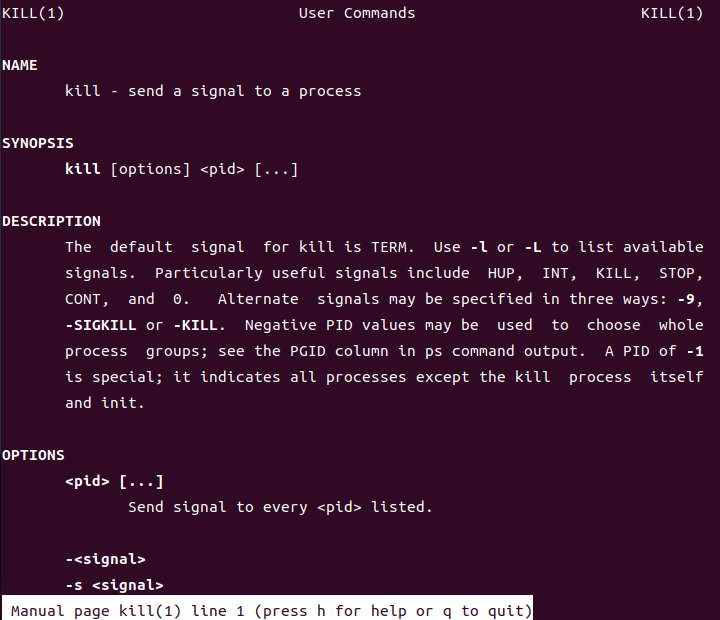
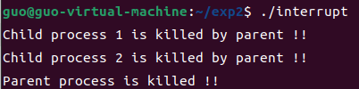
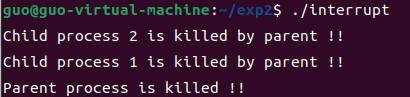
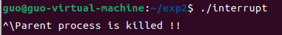
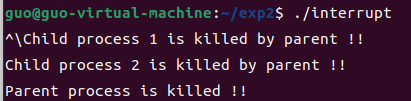
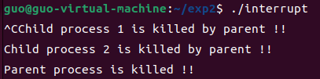
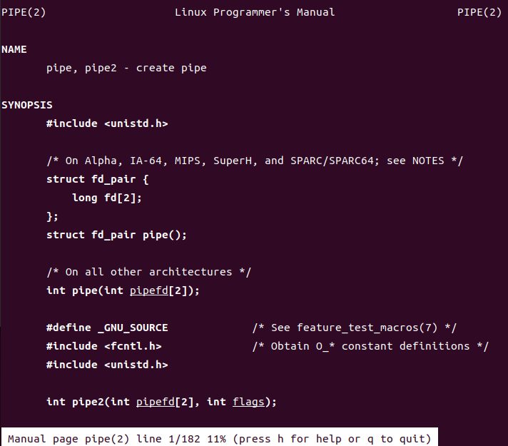
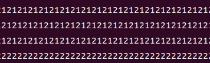
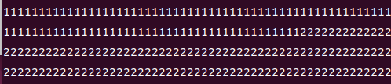
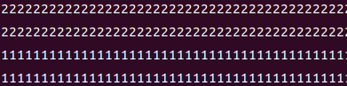

# 操作系统实验2

## 软中断通信

实验前准备：学习man命令的用法，通过它查看fork 、kill 、signal、sleep、exit等系统调用的在线帮助，并阅读参考资料，复习C 语言的相关内容。



相关函数介绍：

**1）sighandler_t signal(int signum, sighandler_t handler);**

头文件：#include <signal.h>

按照参数signum指定的信号编号来设置该信号的处理函数。当指定的信号到达时，就会跳转到参数handler指定的函数执行。

**2）int kill(pid_t pid, int sig);**

头文件：#include <signal.h>

参数pid可能选择有以下四种：

pid > 0 时，pid是信号欲送往的进程的标识。

pid == 0 时，信号将送往所有与调用kill()的那个进程属同一个使用组的进程。

pid == -1 时，信号将送往所有调用进程有权给其发送信号的进程，除了进程1(init)。

pid < -1 时，信号将送往以-pid为组标识的进程。

参数sig是准备发送的信号代码，假如其值为零则没有任何信号送出，但是系统会执行错误检查，通常会利用sig值为零来检验某个进程是否仍在执行。

**3）int pause(void);**

头文件：#include <unistd.h>

挂起本进程以等待信号，接收到信号后恢复执行。当接收到中止进程信号时，该调用不再返回。

**4）unsigned int alarm(unsigned int seconds);**

头文件：#include <unistd.h>

alarm()函数的主要功能是设置信号传送闹钟，即用来设置信号SIGALRM在经过参数seconds秒数后发送给目前的进程。如果未设置信号SIGALARM的处理函数，那么alarm()默认处理是终止进程。

遇到的问题：如何通过键盘发送信号

解决方法：delete 会向进程发送 SIGINT 信号，quit 会向进程发送 SIGQUIT 信号。 ctrl+c 为 delete，ctrl+\为 quit

参考资料：https://blog.csdn.net/mylizh/article/details/38385739

5秒后中断的运行结果如下：





结果分析：哪个子进程先输出取决于CPU调度

5秒内中断的运行结果如下：



观察发现：两个子进程均无输出，但能够正常结束。

结果分析：当从键盘上发送SIGQUIT信号时，子进程也收到了该信号，但由于子进程并未设置相应的信号处理函数，因此执行默认的结束进程操作。

解决方法：在子进程中添加 signal(SIGQUIT, SIG_IGN) 语句，屏蔽SIGQUIT信号。

程序修改后的运行结果如下：



使用SIGINT信号进行中断的程序运行结果如下：



源代码：

```c
#include <stdio.h>
#include <signal.h>
#include <unistd.h>
#include <sys/types.h>
#include <wait.h>
#include <stdlib.h>

pid_t pid1, pid2;

void parent() {
	kill(pid1, 16);
	kill(pid2, 17);
}

void child1() {
	printf("Child process 1 is killed by parent !!\n");
	exit(0);
}

void child2() {
	printf("Child process 2 is killed by parent !!\n");
	exit(0);
}

int main() {

	while ((pid1 = fork()) == -1);

	if (pid1 > 0) {
		while ((pid2 = fork()) == -1);

		if (pid2 > 0) {
			//父进程
			signal(SIGQUIT, parent);
			signal(SIGALRM, parent);
			alarm(5);
			//signal(SIGINT, parent);
			wait(NULL);
			wait(NULL);
			printf("Parent process is killed !!\n");
			exit(0);
		} else {
			//子进程2
			signal(17, child2);
			signal(SIGQUIT, SIG_IGN);
			//signal(SIGINT, SIG_IGN);
			pause();
		}
	} else {
		//子进程1
		signal(16, child1);
		signal(SIGQUIT, SIG_IGN);
		//signal(SIGINT, SIG_IGN);
		pause();
	}
}
```

## 管道通信

实验前准备：学习man 命令的用法，通过它查看管道创建、同步互斥系统调用的在线帮助，并阅读参考资料



相关函数介绍：

**1）int pipe(int fd[2])**

头文件：#include <unistd.h>

用于创建匿名管道（只能用于父子进程之间的通信），参数fd用于描述管道的两端，其中fd[0]是读端，fd[1]是写端。

**2）ssize_t read(int fd, void * buf, size_t count)**

头文件：#include <unistd.h>

从fd中读取count个字节存入buf中

**3）ssize_t write(int fd, void * buf, size_t count)**

头文件：#include <unistd.h>

把buf中的count个字节写入fd中

**4）int lockf(int fd, int function, long size)**

头文件：#include <unistd.h>

fd是文件描述符，function表示锁状态，1表示锁定，0表示解锁，size是锁定或解锁的字节数，若为0则表示整个文件。

管道未加锁时，程序运行结果如下（截取部分）：



观察发现：两个子进程交替向管道输出字符

管道加锁后，程序运行结果如下（截取部分）：



或者：



观察发现：都是先输出2000个相同字符后，再输出2000个另一种相同字符。

结果分析：哪个子进程先输出取决于CPU的进程调度，但由于使用了lockf()函数对管道加锁，因此子进程的输出都是连续的。

源代码：

```c
#include <unistd.h>
#include <stdio.h>
#include <wait.h>
#include <stdlib.h>

int pid1, pid2;

int main() {
	int fd[2];
	char InPipe[5000];		//定义读缓冲区
	char c1 = '1', c2 = '2';
	pipe(fd);				//创建管道

	while ((pid1 = fork()) == -1);

	if (pid1 == 0) {
		//子进程1
		lockf(fd[1], 1, 0);		//锁定管道
		for (int i = 0; i < 2000; i++)
			write(fd[1], &c1, 1);
        sleep(5);
		lockf(fd[1], 0, 0);		//解除锁定
		exit(0);
	} else {

		while ((pid2 = fork()) == -1);

		if (pid2 == 0) {
			//子进程2
			lockf(fd[1], 1, 0);		//锁定管道
			for (int i = 0; i < 2000; i++)
				write(fd[1], &c2, 1);
            sleep(5);
			lockf(fd[1], 0, 0);		//解除锁定
			exit(0);
		} else {
			//父进程
			wait(NULL);
			wait(NULL);
			read(fd[0], InPipe, 4000);
			InPipe[4000] = '\0';
			printf("%s\n", InPipe);
			exit(0);
		}
	}

	return 0;
}
```

## 页面置换

引用串（4帧）：3，6，7，5，3，5，6，2，9，1，2，7，0，9，3，6，0，6，2，6

FIFO置换算法：

<center class="half">
    
    
</center>

缺页错误数为12，命中率为40.00%

LRU置换算法：

<center class="half">
    
    
</center>

缺页错误数为13，命中率为35.00%

Belady异常：

引用串：1，2，3，4，1，2，5，1，2，3，4，5

<center class="half">
    
    
</center>
3帧时，缺页错误数为9；而4帧时，缺页错误数为10

源代码：

```c
#include <stdio.h>
#include <stdbool.h>
#include <stdlib.h>
#include <time.h>
#include <limits.h>

//页表项
typedef struct page {
	unsigned int frame;		//帧号
	bool flag;				//标记位
	unsigned int counter;	//计数器
} page;

page *page_table = NULL;			//页表指针
unsigned int *reference = NULL;		//页面引用串
unsigned int table_size = 10;		//页表大小
unsigned int frame_size = 4;		//帧表大小
unsigned int ref_size = 20;			//引用串大小
unsigned int belady[12] = { 1, 2, 3, 4, 1, 2, 5, 1, 2, 3, 4, 5 };

//初始化页表，将标记位置无效，计数器清零
void initial_page_table() {
	page_table = (page *)malloc(table_size * sizeof(page));
	if (!page_table) {
		printf("page_table: malloc failed!\n");
		exit(0);
	}
	for (unsigned int i = 0; i < table_size; i++) {
		page_table[i].flag = false;
		page_table[i].counter = 0;
	}
}

//初始化引用串
void initial_reference() {
	reference = (unsigned int *)malloc(ref_size * sizeof(unsigned int));
	if (!reference) {
		printf("reference: malloc failed!\n");
		exit(0);
	}
	//srand((unsigned int)time(0));		//随机数种子
	for (unsigned int i = 0; i < ref_size; i++)
		reference[i] = rand() % table_size;
}

//输出引用串
void print_reference() {
	printf("\nreference:\n");
	for (unsigned int i = 0; i < ref_size; i++) {
		printf("%u ", reference[i]);
	}
	printf("\n");
}

//释放页表和引用串的内存
void release() {
	if (page_table)
		free(page_table);
	if (reference && reference != belady)
		free(reference);
}

void Belady(void) {
	ref_size = 12;
	frame_size = 3;
	table_size = 6;
	reference = belady;
}

int FIFO(void) {
	unsigned int diseffect = 0;		//缺页错误数
	unsigned int front = 0;			//队列头
	unsigned int rear = 0;			//队列尾
	unsigned int queue_size = frame_size + 1;
	unsigned int *queue = (unsigned int *)malloc(queue_size * sizeof(unsigned int));
	if (!queue) {
		printf("queue: malloc failed!\n");
		exit(0);
	}

	for (unsigned int i = 0; i < ref_size; i++) {
		printf("Page %u arrives ", reference[i]);
		//页面不在帧中
		if (!page_table[reference[i]].flag) {
			printf("but not in the frame.\n");
			diseffect++;
			if ((rear + 1) % queue_size == front) {
				//帧满换出
				page_table[queue[front]].flag = false;
				front = (front + 1) % queue_size;
			}
			//页面换入
			page_table[reference[i]].flag = true;
			page_table[reference[i]].frame = rear;
			queue[rear] = reference[i];
			rear = (rear + 1) % queue_size;
			//输出当前帧中内容
			printf("frame: ");
			for (unsigned int k = front; k != rear; k = (k + 1) % queue_size)
				printf("|%u| ", queue[k]);
			printf("\n");
		} else {
			//页面在帧中
			printf("and in the frame.\n");
		}
	}

	free(queue);
	return diseffect;
}

//查找最早到达的页面
int find_min(unsigned int *frame) {
	unsigned int min = UINT_MAX, frame_num = 0;
	for (unsigned int i = 0; i < frame_size; i++) {
		if (page_table[frame[i]].counter < min) {
			min = page_table[frame[i]].counter;
			frame_num = i;
		}
	}
	return frame_num;
}

unsigned int LRU(void) {
	unsigned int diseffect = 0;		//缺页错误数
	unsigned int clock = 0;			//逻辑时钟
	unsigned int full = 0;			//帧满标识
	unsigned int *frame = (unsigned int *)malloc(frame_size * sizeof(unsigned int));
	if (!frame) {
		printf("frame: malloc failed!\n");
		exit(0);
	}

	for (unsigned int i = 0; i < ref_size; i++) {
		printf("Page %u arrives ", reference[i]);
		//考虑时钟溢出
		if (clock == UINT_MAX) {
			unsigned int min;
			unsigned int* temp = (unsigned int*)malloc(frame_size * sizeof(unsigned int));
			for (unsigned int i = 0; i < frame_size; i++) {
				min = find_min(frame);
				temp[i] = frame[min];
				page_table[frame[min]].counter = UINT_MAX;
			}
			for (unsigned int i = 0; i < frame_size; i++)
				page_table[temp[i]].counter = i;
			free(temp);
			clock = frame_size;
		}
		page_table[reference[i]].counter = clock;
		clock++;
		//页面不在帧中
		if (!page_table[reference[i]].flag) {
			printf("but not in the frame.\n");
			diseffect++;
			if (full < frame_size) {
				//帧未满时
				page_table[reference[i]].flag = true;
				page_table[reference[i]].frame = full;
				frame[full] = reference[i];
				full++;
			} else {
				unsigned int replace = find_min(frame);
				//页面换出
				page_table[frame[replace]].flag = false;
				//页面换入
				page_table[reference[i]].flag = true;
				page_table[reference[i]].frame = replace;
				frame[replace] = reference[i];
			}
			//输出当前帧中内容
			printf("frame: ");
			for (unsigned int k = 0; k < full; k++)
				printf("|%u| ", frame[k]);
			printf("\n");
		} else {
			//页面在帧中
			printf("and in the frame.\n");
		}
	}

	free(frame);
	return diseffect;
}

//设置参数
char set_parameter(void) {
	//置换算法或Belady异常现象
	printf("\nChoice: 1)FIFO      2)LRU      3)FIFO(Belady)\n");
	char choice = getchar();
	while (getchar() != '\n');
	if (choice == '3') {
		Belady();
		return choice;
	}

	unsigned int size = 0;
	//页表大小
	printf("Please enter the size(0 < size <= 128) of the page_table: ");
	if (scanf("%u", &size) == 1 && size > 0 && size <= 128)
		table_size = size;
	else {
		table_size = 10;
		printf("default = 10\n");
	}
	while (getchar() != '\n');
	//帧表大小
	printf("Please enter the size(0 < size <= 32) of the frame: ");
	if (scanf("%u", &size) == 1 && size > 0 && size <= 32)
		frame_size = size;
	else {
		frame_size = 4;
		printf("default = 4\n");
	}
	while (getchar() != '\n');
	//引用串大小
	printf("Please enter the size(0 <= size <= 100) of the reference: ");
	if (scanf("%u", &size) == 1 && size >= 0 && size <= 100)
		ref_size = size;
	else {
		ref_size = 20;
		printf("default = 20\n");
	}
	while (getchar() != '\n');

	return choice;
}

int main(void) {
	printf("*********************************\n");
	printf("       PAGE REPLACEMENT\n");
	printf("*********************************\n\n");

	char choice1 = set_parameter();
	if (choice1 != '3')
		initial_reference();
	unsigned int diseffect;

	while (true) {
		print_reference();
		initial_page_table();

		switch (choice1) {
			case '1':
				printf("\nFIFO:\n\n");
				diseffect = FIFO();
				break;
			case '2':
				printf("\nLRU:\n\n");
				diseffect = LRU();
				break;
			case '3':
				printf("\nFIFO(Belady):\n\n");
				diseffect = FIFO();
				break;
			default:
				printf("\ndefault = FIFO:\n\n");
				diseffect = FIFO();
		}

		printf("\nPage fault: %d\n", diseffect);
		printf("ratio: %.2f%%\n", (1.0 - (float)diseffect / ref_size) * 100.0);

		printf("\nQuit? [defualt[Enter] = 'No', [y] = 'yes']: ");
		//退出程序
		if (getchar() == 'y') {
			release();
			break;
		}

		printf("\nReset? [defualt[Enter] = 'No', [y] = 'yes']: ");
		if (getchar() == 'y') {
			while (getchar() != '\n');
			//重置参数
			release();
			choice1 = set_parameter();
			if (choice1 != '3')
				initial_reference();
		} else {
			printf("\n1)Change the algorithm       2)Change the size of frame\n");
			unsigned int size = 0;
			char choice2 = getchar();
			while (getchar() != '\n');
			switch (choice2) {
				case '1':
					//更改算法
					choice1 = (choice1 == '2') ? '1' : '2';
					break;
				case '2':
					//更改帧表大小
					printf("\nThe new size(0 < size <= 32) of the frame: ");
					if (scanf("%u", &size) == 1 && size > 0 && size <= 32)
						frame_size = size;
					else {
						frame_size = 4;
						printf("default = 4\n");
					}
					while (getchar() != '\n');
					break;
				default:
					printf("default: Change the algorithm\n");
					choice1 = (choice1 == '2') ? '1' : '2';
			}
		}
	}

	return 0;
}
```
