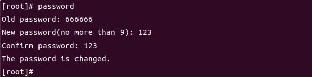

# 操作系统实验3-文件系统

## 运行结果

### login

登录文件系统，初始密码为：666666。

### password

使用password指令更改密码。

### mkdir与ls

使用mkdir指令创建目录，并使用ls指令列出当前目录下的内容。

### cd

使用cd指令进入目录，cd后面加目录名进入对应目录，加“..”回到上级目录，加“.”仍留在当前目录，加空格或“~”返回根目录。

### rmdir

使用rmdir指令删除目录，注意：这里的实现只能删除空目录。

### create

使用create指令创建新文件。

### open与write

使用open指令打开文件，使用write指令写入文件，输入SIGQUIT作为写操作结束标识。

### read

使用read指令读取文件。

### close与delete

使用delete指令删除文件，注意：删除前应先使用close指令关闭文件。

### chmod

使用chmod指令修改文件访问权限，将文件的访问权限修改为只读后，无法再调用write指令对该文件进行写操作。

### check

使用check指令显示磁盘相关信息，包括：卷名、数据块大小、空闲数据块个数、空闲索引结点个数、文件系统当前的目录总数。

### format

使用format指令格式化磁盘。

## 遇到的问题

### 如何对文件（虚拟磁盘）进行读写操作

使用fopen、fclose打开与关闭文件，使用fseek定位文件指针的位置，使用fread、fwrite对文件进行读写。

### 如何处理变长的目录项

存取：将数据块读取到字节数组中后，将指向字节数组的指针强制类型转换为指向dir_entry，此时就可以对目录项进行操作；写入操作同理。此外，为了防止写入时溢出，将数据块的缓冲区定义为1024B，但实际存储的有效大小为前512B。

定位：rec_len记录了目录项的大小，将它与当前目录的起始地址相加，就得到了下一个有效目录的起始地址。要删除当前这个目录，只需要将inode置为0，并增加前一个目录项的rec_len的值，以“跳过”当前这个删除的目录。

同时，发现目录项结构体dir_entry的大小应为261B，但使用sizeof运算符得出的实际大小却是262B，猜测是因为字节对齐。

参考资料：https://blog.csdn.net/qwertyupoiuytr/article/details/70471623

### 如何判断写操作的结束

最开始的想法是使用EOF（Windows下是ctrl+z，Linux下是ctrl+d）作为写操作的结束标识。此方法在Windows下运行良好，但在Linux下输入EOF后会导致后续的所有输入函数失效，程序异常终止。

在查找资料的过程中，找到了一个类似的提问（https://stackoverflow.com/questions/57648464/），但并未给出解决方案。

最终的解决方案：使用软中断，自定义SIGQUIT（ctrl+\）信号处理函数，用以退出写操作循环。

### 如何debug

在对文件（虚拟磁盘）进行读写时，可能会把数据写入到错误的块中，或是从错误的块中读取了数据，此时单凭检查程序难以发现问题所在。可以借助于软件Hex Editor Neo以16进制模式查看文件，观察存储在文件（虚拟磁盘）中的二进制串，方便定位错误。

