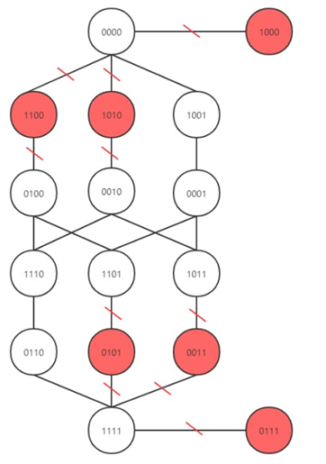
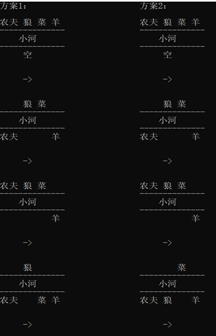
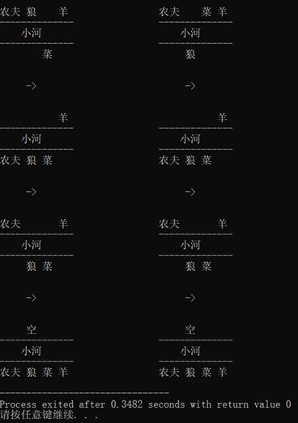

# 《实验二——农夫过河问题的求解》

## （一）问题描述

​		一个农夫带着一只狼、一只羊和一棵白菜，身处河的南岸。他要把这些东西全部运到北岸。他面前只有一条小船，船只能容下他和一件物品，另外只有农夫才能撑船。如果农夫在场，则狼不能吃羊，羊不能吃白菜，否则狼会吃羊，羊会吃白菜，所以农夫不能留下羊和白菜自己离开，也不能留下狼和羊自己离开，而狼不吃白菜。请求出农夫将所有的东西运过河的方案。

## （二）解决思路

​		求解这个问题的简单方法是一步一步进行试探，每一步搜索所有可能的选择，对前一步合适的选择后再考虑下一步的各种方案。

​		要模拟农夫过河问题，首先需要对问题中的每个角色的位置进行描述。可用4位二进制数顺序分别表示农夫、狼、白菜和羊的位置。用0表示在南岸，1表示在北岸。例如，整数5 (0101)表示农夫和白菜在南岸，而狼和羊在北岸。

​		现在问题变成：从初始的状态二进制0000(全部在河的南岸)出发，寻找一种全部由安全状态构成的状态序列，它以二进制1111（全部到达河的北岸）为最终目标。总状态共16种（0000到1111或者看成16个顶点的无向图），可采用广度优先或深度优先的搜索策略——得到从0000到1111的安全路径。

​		选择以深度优先算法进行搜索，每访问一个顶点就将其入栈，然后访问栈顶元素的邻接顶点，若没有邻接顶点则将其出栈，不断重复这个过程直至找到目标顶点。

​		最终的过河方案应用汉字显示出每一步的两岸状态。

​		因此，问题的求解共分为三个模块：无向图的创建、寻找所有的安全路径、输出所有的安全路径。

## （三）数据结构

​		1、图：将四位二进制数字0000到1111（即十进制中的0到15）16种状态作为顶点，若能从某一状态一步进入另一状态，则认为两顶点邻接。由于顶点个数固定，故采用邻接矩阵的方法存储图。

​		2、栈：在进行深度优先搜索路径时，需要使用到栈。由于栈中存储的元素较少，不容易产生溢出现象，故采用顺序表（即数组）存储栈。

## （四）算法分析

① 无向图的创建：

（a）初始化邻接矩阵，将对角线元素初始化为0，其余元素初始化为1；

（b）依次访问所有顶点，判断其是否处于安全状态。若不是，将标志位设置为1，并将邻接矩阵中的相应元素设置为0，使得该顶点无邻接顶点；

（c）依次访问所有标志位为0的顶点，判断任意两个顶点间是否直接相连。若没有，将邻接矩阵中的相应元素设置为0；

（d）将标志位全部重置为0。

建立好的无向图（红色顶点表示不安全状态）如下所示：

② 寻找所有的安全路径：

（a）访问某一顶点，入栈，并将标志位设置为1；

（b）检查该顶点是否是目标顶点，若是，则输出路径；

（c）访问栈顶元素的未访问过（即标志位为0）的邻接顶点（若存在）；

（d）若栈顶元素不存在满足（c）中条件的邻接顶点，则出栈，并将标志位重置为0；

（e）重复执行上述操作。

③ 输出所有的安全路径：

（a）创建指针数组，用于指向16种状态所对应的情形（如0100对应于“农夫  菜 羊”）；

（b）从栈底元素开始直至栈顶，先输出二进制对应的字符串，然后输出“河流”，再将二进制按位取反，得到河对岸情形所对应的二进制表示，并将其对应字符串输出。

## （五）运行结果

## （六）反思总结

​		程序中建立的邻接矩阵的稀疏因子Γ=0.078125，故该邻接矩阵近似于一个稀疏矩阵，矩阵中含有大量零元素，造成极大的空间浪费。此外，使用邻接矩阵存储图时，遍历全部顶点所需的时间为O(n^2)，效率较低。因此，可以采用邻接表替代邻接矩阵来存储图，从而对程序进行改进和优化。

​		通过本次实验，我进一步掌握了图和栈这两种数据结构，独立实现了图的深度优先搜索算法以及出栈与入栈的操作。此外，我还了解了C语言的位操作，并学会了如何对一个实际问题进行数学建模以及将其转化为程序语言去解决问题的方法。