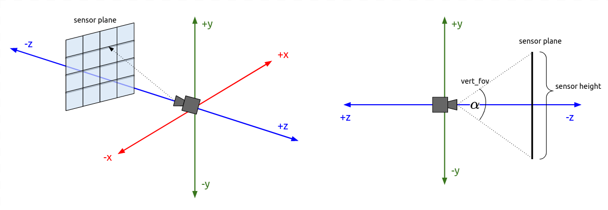
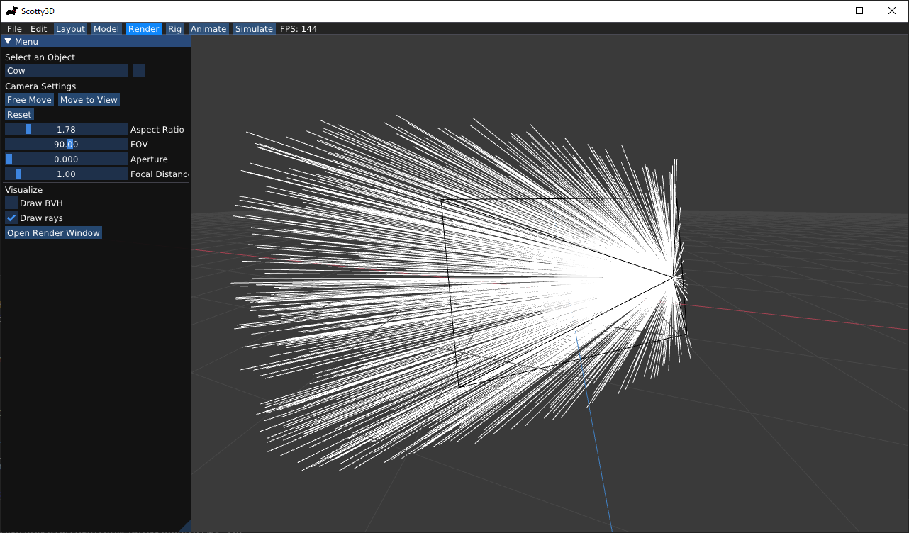
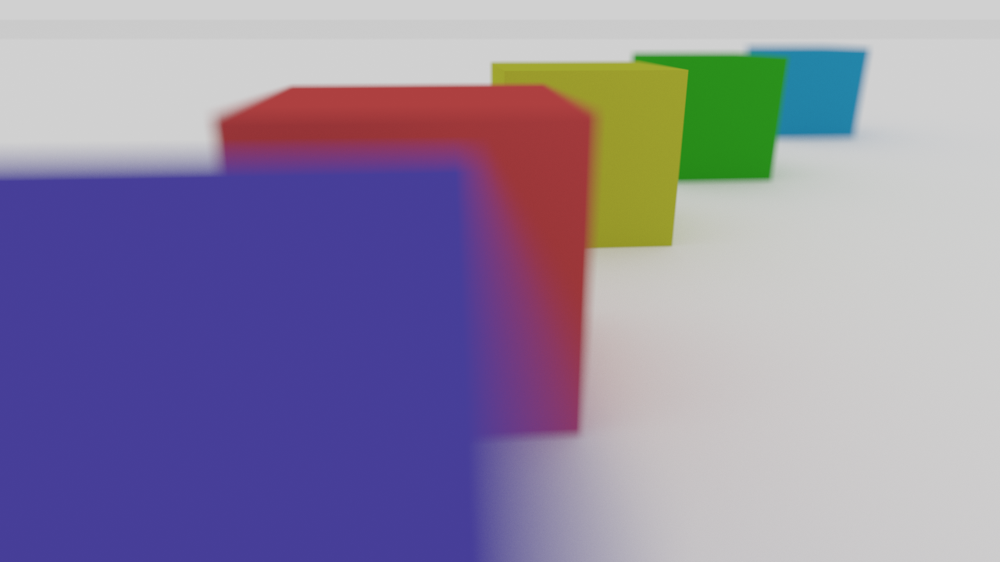

# (Task 1) Generating Camera Rays

## Walkthrough
<video width="750" height="500" controls>
    <source src="videos/Task1_CameraRays.mp4" type="video/mp4">
</video>

"Camera rays" emanate from the camera and measure the amount of scene radiance that reaches a point on the camera's sensor plane. (Given a point on the virtual sensor plane, there is a corresponding camera ray that is traced into the scene.) Your job is to generate these rays, which is the first step in the raytracing procedure.

---

## Step 1: `Pathtracer::trace_pixel`
Take a look at `Pathtracer::trace_pixel` in `student/pathtracer.cpp`. The job of this function is to compute the amount of energy arriving at this pixel of the image. Conveniently, we've given you a function `Pathtracer::trace(r)` that provides a measurement of incoming scene radiance along the direction given by ray `r`, split into emissive (direct) and reflected (indirect) components. See `lib/ray.h` for the interface of ray.

Given the width and height of the screen, and a point's _screen space_ coordinates (`size_t x, size_t y`), you should compute the point's _normalized_ $$([0-1] \times [0-1])$$ screen space coordinates in `Pathtracer::trace_pixel`. Pass these coordinates to the camera via `Camera::generate_ray` in `camera.cpp` (note that `Camera::generate_ray` accepts a `Vec2` object as its input argument).

This part has already been implemented for you, but be sure to understand what the code is doing.

## Step 2: `Camera::generate_ray`
Implement `Camera::generate_ray`. This function should return a ray **in world space** that reaches the given sensor sample point, i.e. the input argument. We recommend that you compute this ray in camera space (where the camera pinhole is at the origin, the camera is looking down the -Z axis, and +Y is at the top of the screen.). In `util/camera.h`, the `Camera` class stores `vert_fov` and `aspect_ratio` indicating the vertical field of view of the camera (in degrees, not radians) as well as the aspect ratio. 

The camera class also maintains a camera-space-to-world space transform matrix `iview` that you will need to use in order to get the new ray back into **world space**. Note that since `iview` is a **transform matrix**; it contains translation, rotation, and scale factors. Be careful in how you use it directly on specific objects (specifically when it's applied to a position versus a direction), and take a look at `lib/ray.h` and `lib/mat4.h` to see what functions are available for the `Ray` and `Mat4` objects.

## Step 3: `Pathtracer::trace_pixel` &#8594; Super-sampling
Your implementation of `Pathtracer::trace_pixel` must support super-sampling. The starter code will hence call `Pathtracer::trace_pixel` one time for each sample (number of samples specified by `Pathtracer::n_samples`, so your implementation of `Pathtracer::trace_pixel` should choose a **single** new location within the pixel each time it is called.

To choose a sample within the pixel, you should implement `Rect::sample` (see `src/student/samplers.cpp`), such that it provides a random uniformly distributed 2D point within the rectangular region specified by the origin and the member `Rect::size`. You can then create a `Rect` sampler with a one-by-one size and call `sample()` to obtain randomly chosen offsets within the pixel.

Once you have implemented `Pathtracer::trace_pixel`, `Rect::sample` and `Camera::generate_ray`, you should have a working camera (see **Raytracing Visualization** section below to confirm that your camera is indeed working).

### Tips

- Since you won't be sure your camera rays are correct until you implement primitive intersections, we recommend debugging camera rays by checking what your implementation of `Camera::generate_ray` does with rays at the center of the screen $$(0.5, 0.5)$$ and at the corners of the image.

### Raytracing Visualization

Your code can also log the results of ray computations for visualization and debugging. To do so, simply call the function `Pathtracer::log_ray` in your `Pathtracer::trace_pixel`. Function `Pathtracer::log_ray` takes in 3 arguments: the ray that you want to log, a float that specifies the distance to log that ray up to, and a color for the ray. If you don't pass a color, it will default to white. We encourage you to make use of this feature for debugging both camera rays and those used for sampling direct & indirect lighting.

One thing to note is that you should only log only a small fraction of the generated rays. Otherwise, your result will contain too many generated rays, making the result hard to interpret. To do so, you can add `if(RNG::coin_flip(0.0005f)) log_ray(out, 10.0f);` to log $$0.05$$% of camera rays.

Finally, you can visualize the logged rays by checking the box for Logged rays under Visualize and then **starting the render** (Open Render Window -> Start Render). After running the path tracer, rays will be shown as lines in visualizer. Be sure to wait for rendering to complete so you see all rays while visualizing.

---

## Extra Credit

### Defous Blur and Bokeh (1 point each)

`Camera` also includes the members `aperture` and `focal_dist`. **Aperture** is the opening in the lens by which light enters the camera.  **Focal distance** represents the distance between the camera aperture and the plane that is perfectly in focus.  These parameters can be used to simulate the effects of de-focus blur and bokeh found in real cameras.

To use the focal distance parameter, you simply scale up the sensor position from step $$2$$ (and hence ray direction) by `focal_dist` instead of leaving it on the $$z = -1$$ plane. You might notice that this doesn't actually change anything about your result, since this is just scaling up a vector that is later normalized. However, now aperture comes in.

By default, all rays start a single point, representing a pinhole camera. But when `aperture` $$> 0$$, we want to randomly choose the ray origin from an `aperture`$$\times$$`aperture` square centered at the origin and facing the camera direction $$(-Z)$$. Note that typically aperture of a camera is roughly circular in shape, but a square suffices for our purposes.

Then, we can use this random point as the origin of the generated ray while keeping its sensor position fixed (consider how this changes the ray direction). Now it's as if the same image was taken from slightly off origin. This simulates real cameras with non-pinhole apertures: the final photo is equivalent to averaging images taken by pinhole cameras placed at every point in the aperture.

Finally, we can see that non-zero aperture makes focal distance matter: objects on the focal plane are unaffected, since where the ray hits on the sensor is the same regardless of the ray's origin. However, rays that hit objects closer or farther than the focal distance will be able to "see" slightly different parts of the object based on the ray origin. Averaging over many rays within a pixel, this results in collecting colors from a region larger slightly than that pixel would cover given zero aperture, causing the object to become blurry. We are using a square aperture, so bokeh effects will reflect this.

You can test aperture/focal distance by adjusting `aperture` and `focal_dist` using the camera UI and examining logging rays. Once you have implemented primitive intersections and path tracing (tasks 2/4), you will be able to properly render `dof.dae`:

### Low-discrepancy Sampling
Write your own pixel sampler (replacing `Rect`) that generates samples with a more advanced distribution. Refer to [Physically Based Rendering](http://www.pbr-book.org/3ed-2018/) chapter 7. Some examples include:
  - Jittered Sampling (1 point)
  - Multi-jittered sampling (1 point)
  - N-Rooks (Latin Hypercube) sampling (2 points)
  - Sobol sequence sampling (2 points)
  - Halton sequence sampling (3 points)
  - Hammersley sequence sampling (3 points)
