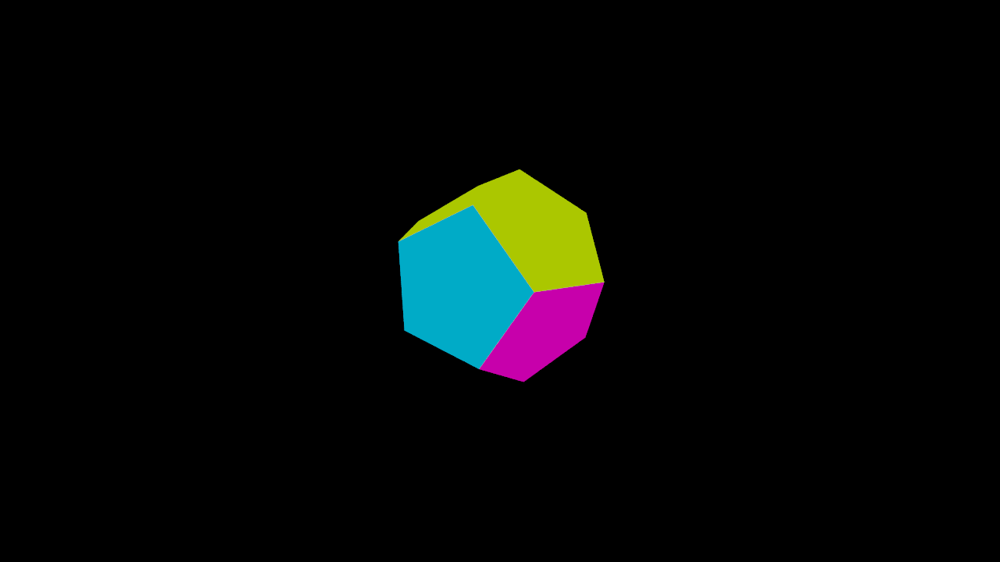
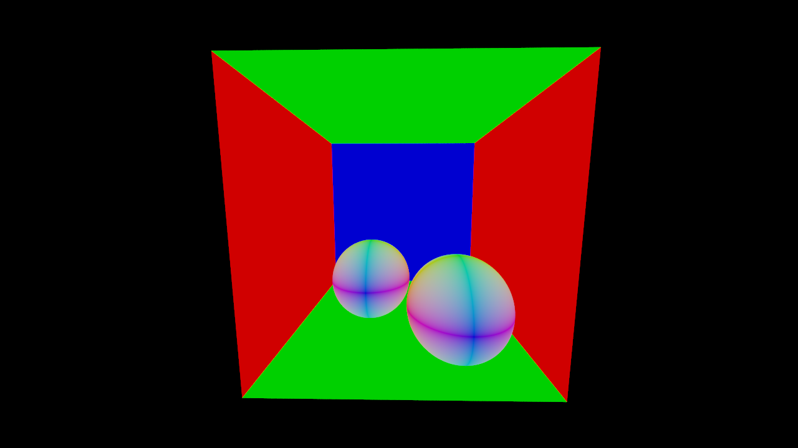
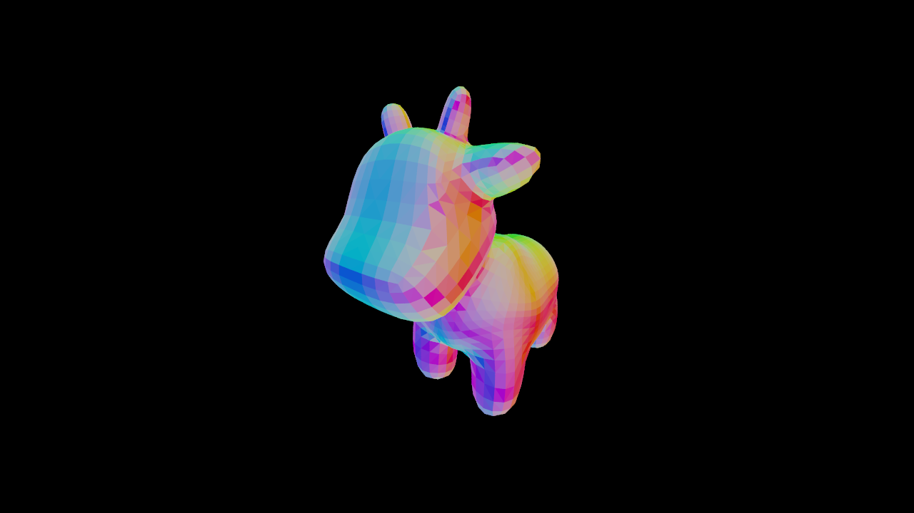

# (Task 2) Intersecting Objects

Now that your ray tracer generates camera rays, we need to be able to answer the core query in ray tracing: "does this ray hit this object?" Here, you will start by implementing ray-object intersection routines against the two types of objects in the starter code: **triangles** and **spheres**.

First, take a look at `rays/object.h` for the interface of the `Object` class. An `Object` can be **either** a `Tri_Mesh`, a `Shape`, a BVH(which you will implement in Task $$3$$), or a list of `Objects`. Right now, we are only dealing with `Tri_Mesh`'s case and `Shape`'s case, and their interfaces are in `rays/tri_mesh.h`  and `rays/shapes.h`, respectively. `Tri_Mesh` contains a BVH of `Triangle`, and in this task you will be working with the `Triangle` class. For `Shape`, you are going to work with a `Sphere`, which is the major type of `Shape` in Scotty 3D.

Now, you need to implement the `hit` routine for both `Triangle` and `Sphere`. `hit` takes in a ray, and returns a `Trace` structure, which contains the following information:

* `hit`: a boolean representing if there is a hit or not.
* `distance`: the distance from the origin of the ray to the hit point.
* `position`: the position of the hit point. This can be computed from `ray.at(distance)` since the ray's direction is normalized.
* `normal`: the shading normal of the surface at the hit point. The shading normal for a triangle is computed by linear interpolation from per-vertex normals using the barycentric coordinates of the hit point as their weights. The shading normal for a sphere is the same as its geometric normal.
* `origin`: the origin of the query ray (ignore).
* `material`: the material ID of the hit object (ignore).

In order to correctly implement `hit`, you will also need to understand some of the fields in the Ray structure defined in `lib/ray.h`.

* `point`: the 3D point of origin of the ray
* `dir`: the 3D direction of the ray (always normalized)
* `dist_bounds`: the minimum and maximum distance along the ray. Primitive intersections that lie outside the [`ray.dist_bounds.x`, `ray.dist_bounds.y`] range should be disregarded.
* `depth`: the recursive depth of the ray (Used in task $$4$$).
* `throughput`: the fraction of incoming light along this ray that will contribute to the final image (Optionally used in task $$4$$).

One important detail of the ray structure is that `dist_bounds` is a mutable field. This means that it can be modified even in `const` rays, for example within `Triangle::hit`. When finding the first intersection of a ray and the scene, you will want to update the ray's `dist_bounds` value after finding each hit with scene geometry. By bounding the ray as tightly as possible, your ray tracer will be able to avoid unnecessary tests with scene geometry that is known to not be able to result in a closest hit, resulting in higher performance.

---

## Reference Results

You should now be able to render all of the example scenes colored based on surface normals. Note that scenes with high geometric complexity will be extremely slow until you implement task 3. Here is `dodecahedron.dae`, `cbox.dae`, and `cow.dae`:

